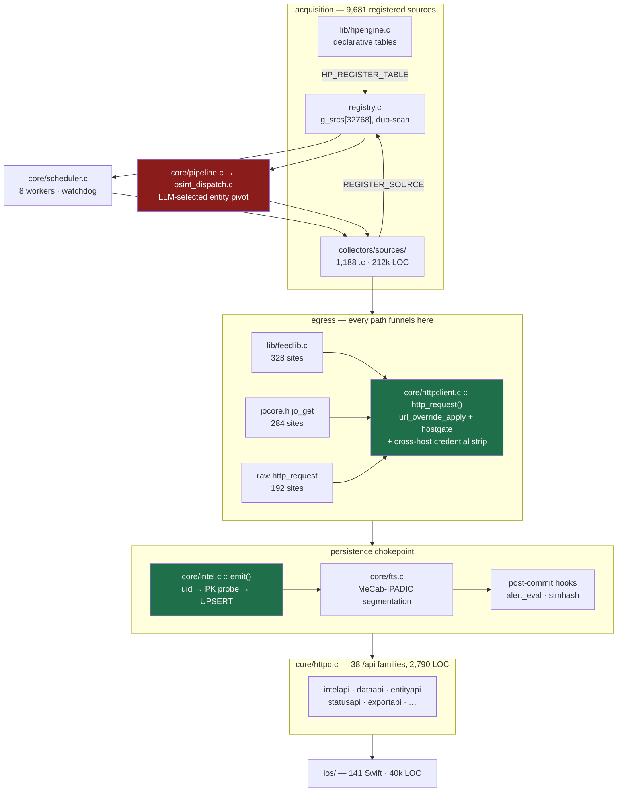
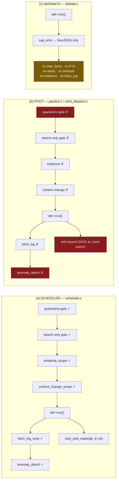
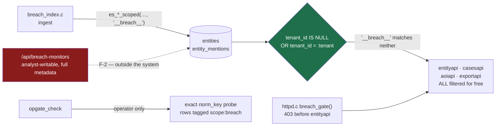
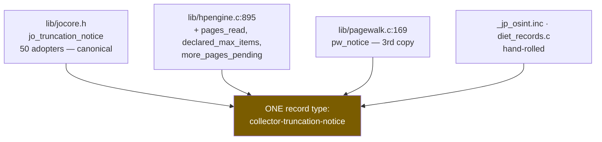

# JapanOSINT — full codebase audit (second pass)

_2026-08-10, later the same day · 6-agent read-only sweep + orchestrator verification_
_Scope: `native/` (C engine), `ios/`, build, tests, CI, docs._
_**Report only. No code was changed by this audit.**_

> This audit runs against a tree that was heavily modified earlier the same day:
> **314 files changed, +6,631 / −1,142, all uncommitted**, plus 8 new files and
> 80 deletions. That makes the newest code the least-reviewed code in the repo,
> so it was audited hardest and is called out separately throughout.

---

## 0. Verified baseline

Every number here comes from a command run during this audit, not from a prior
report.

| Check | Result |
|---|---|
| Warnings, build flags, **from scratch** | **0** across **1,286** translation units |
| Warnings, stricter flags | 43 — see §1, both classes assessed benign |
| AddressSanitizer over the unit suite | **0 reports** — corrected below |
| `hptest` (48 assertions) | pass |
| `pagewalktest` (35 assertions) | pass |
| `authtest` (11 assertions) | pass |
| `htmlparsetest` (28 assertions) | pass |
| `selftest` / `unit` | pass |
| `make lint-sources` | OK — 6 of 7 checks at **0** |
| `make audit-sources` | 66 findings / 50 files of 1,211 scanned; strict set 0 |
| `make source-count` vs `--list-sources` | **9,681 == 9,681**, id-for-id |

### Size

| Subsystem | Files | LOC |
|---|---|---|
| `collectors/sources/` | 1,188 `.c` + 9 `.inc` | 212,453 |
| `core/` | 75 `.c` + 75 `.h` | 58,590 |
| `lib/` | 21 `.c` + 24 `.h` | 6,531 |
| `ios/JapanOsintApp/` | 141 Swift | 39,950 |
| **first-party C total** | | **277,896** |
| `third_party/` (vendored) | 3 `.c` + 3 `.h` | 295,176 |

`client/` (React, ~14,700 LOC) was deleted earlier today and is not audited.

> **Correction to the ASan row.** `tests/audit/build_asan.sh` passes
> `-fsanitize=address` via `CFLAGS`, but the `sqlite3.o` and `mongoose.o` rules
> (`Makefile:74-76`, `:82-84`) hardcode `$(CC) -O2 -g …` and ignore `CFLAGS`.
> The "0 reports" above came from a binary that is **uninstrumented inside
> SQLite and inside the mongoose HTTP request parser** — the first code to touch
> attacker-controlled bytes. The Makefile's own `asan` target puts the flag in
> `CC` and does reach them; the audit harness diverged from it. The figure is
> real for first-party C and means nothing for those two libraries.

---

## 1. The two stricter-flag warning classes, assessed

Neither is a defect, and both are recorded here so the next audit does not
re-litigate them.

**36 × `-Wformat-nonliteral`** — the dominant shape is
`snprintf(url, sizeof url, r->url_tmpl, enc)`, a format string read from a
per-source table (10 of them in `denki_yoho.h`, the rest across the `world_reg_*`
and `reg_*` registry families). That is UB the moment a template contains a
conversion the call does not supply an argument for. **Verified safe today**: of
**310** URL templates carrying a conversion, **308 contain only `%s`**, and the
two exceptions (`gazette_world.c`) use a correctly-escaped `%%`. It is a latent
hazard — one pasted `%5B` away — not a live bug.

**7 × `-Wcast-align`** — all seven are `struct sockaddr *` → `sockaddr_in*` /
`sockaddr_in6*` in `dns_records.c`, `soc_supplychain.c`, `ssl_analyzer.c` and
`hostgate.c`. That is the standard `getaddrinfo` idiom; the resolver returns
suitably-aligned storage. Known false-positive class.

---

## 2. What changed earlier today

| | |
|---|---|
| Modified | 313 |
| Deleted | 80 (`client/` + root `package.json`) |
| New | 8 |

New modules, all with no history and therefore the prime audit targets:

- `lib/pagewalk.{c,h}` — pagination + truncation disclosure for the generated fleet
- `core/pagination_probe.{c,h}` — an admin-triggered survey that proves which sources paginate
- `tests/pagewalk_test.c`, `tests/auth_jwk_test.c`, `tests/htmlparse_test.c`
- `docs/codebase-audit-2026-08-10.md`

Largest diffs: `httpd.c` (+379), `entityapi.c` (+328), `lint_sources.py` (+316),
`entitystore.c` (+294), `prompts.c` (+243), `breach_monitor.c` (+214).

---

## 3. Architecture — the whole system on one page

There is exactly **one** data-acquisition ABI (`native/source.h`, 145 LOC) and
exactly **two** registration macros (`REGISTER_SOURCE`, `HP_REGISTER_TABLE`).
Everything a collector can do is reachable from that one header. That is the
single best structural property of this codebase and it should be defended.



**The one inversion worth stating**, because it contradicts the obvious
assumption: raw `http_request()` is **not** less safe than the wrappers.
`url_override_apply`, `hostgate`, and cross-host credential stripping all live
*inside* `http_request` (`httpclient.c:264-308`), so all 192 raw call sites get
identical protection. What the wrappers add is retry budget, timeout policy and
Shift-JIS transcoding — not safety. The only true bypass in the tree is code
that does not use `http_request` at all (see F-2).

### 3.1 The two run paths are not the same path

This is the most consequential structural fact in the system. The *same*
`def->run()` behaves differently depending on which of three sinks it is handed.



Eleven divergences were mapped; five matter:

| # | Scheduled | Pivot | Consequence |
|---|---|---|---|
| D1 | sink bound to `d->id` | bound once as `osint-search` | pivot rows are **not attributable** to the source that produced them; uids become `osint-search\|<key>` |
| D3/D4 | evidence + content-change scopes | neither | no chain-of-custody on any pivot fetch |
| D5/D6 | `fetch_log_write` → `anomaly_detect` | neither | a broken pivot source never trips the circuit breaker |
| D7 | quarantine + search-only gates | **neither** | a quarantined source stays fully dispatchable |
| D2 | `ctx->source_id = d->id` | upper-cased canon | anything keyed on `source_id` sees a different string |

D6 and D7 together are a closed loop: the pivot path cannot quarantine a source,
and does not honour quarantine if some other path sets it. **That is why F-1
below is worse than it first reads.**

---

## 4. Findings

Every finding here was re-verified by me against the source after the agent
reported it. Two agent claims were rejected outright and are noted in §4.5.

### 4.1 Security — 3 HIGH

**F-1 · `/api/search/analyze` reaches raw sockets that bypass the entire SSRF stack.**
`port_scanner.c` declares `.collector="osint"`, so `osint_dispatch.c:74/93`
advertises `PORT_SCANNER` *by name* in the LLM's schema enum. On selection,
`ctx->entity` — caller-supplied text — flows to `gethostbyname` (`:32`),
`socket` (`:36`), `connect` (`:40`) across 22 ports. There is **no hostgate call
in the file**. This is not a gate that was forgotten; it is a code path that
does not use `http_request` at all, so no amount of hardening inside the HTTP
primitive can reach it. `SSL_ANALYZER` accepts an arbitrary port on the same
basis. Results persist to `intel_items` and return via
`/api/search/results/:id`, so it is a **read primitive, not blind**.
Precondition: any valid JWT — no role, no rate limit. Compounded by D6/D7:
the circuit breaker cannot fire on this path.
*Pre-existing. The one unverified link is whether a crafted prompt reliably
drives the LLM's selection; the code path itself is confirmed by reading.*

**F-2 · `/api/breach-monitors` is the exposure oracle that the rest of the tree
was just hardened to prevent.** `breach_monitor.c:642` `can_write()` admits
owner, admin **and analyst**. `monitor_hits` returns `name, title, domain,
breach_date, added_date, pwn_count, data_classes_json, verified, sensitive` for
any identifier the caller submits. `entityapi_breaches_scoped` returns NULL for
*every* entity to a non-operator — breached or not — precisely so the response
cannot be used as an oracle, and its own comment says so. This route answers the
same question with richer metadata behind a weaker gate. The `ES_BREACH_TENANT`
quarantine (§5) is architecturally elegant and this is the door it does not
cover. *Pre-existing.*

**F-3 · `es_breach_scope_migrate` can roll back its caller's transaction.**
`entity_enrich.c:109` opens `BEGIN`; `:117` calls `es_upsert_entity` →
`es_breach_scope_migrate` → a **nested** `BEGIN` inside a multi-statement
`sqlite3_exec`. The nested BEGIN fails, `exec` aborts the script, and
`entitystore.c:122` then runs `ROLLBACK` — which SQLite applies to the *caller's*
open transaction. The once-guard latches only on success (deliberately, so a
transient failure can retry), so once the boot call at `db.c:364` fails this
recurs on **every** enrichment batch for the process lifetime, silently
discarding NER work. *Introduced today.*

### 4.2 House rule 2 (never discard) — 5 HIGH

The irony is unavoidable and should be stated plainly: **the module written
today to end silent discards is itself the largest new source of them.**

**F-4 · `pagewalk.c` decides "was that page full?" using the wrong number.**
`:259` and `:276` both test `last_n >= page_size`, where `last_n` is what the
emitter *returned* — and `jsonlist.c:330` returns 0 for any record it cannot
label (`if (!title) { free(when); return 0; }`). So a genuinely full page of 20
containing 2 unlabelled records reports 18: the walk stops **and** `full_last`
is false, so **no truncation notice is emitted at all**. Silent stop plus a
silent claim of completeness — the exact failure this module exists to end.
Proven by execution against the real `pagewalk.c`:
`fetches=1 returned=2 rows_emitted=2 notices=0` on a full page.
`tests/pagewalk_test.c` cannot catch it: its `script_emit` emits one row per
element into an always-succeeding sink, so emitted always equals seen.
Blast radius ~3,960 VJSON+VCSV sources. *Introduced today.*

**F-5 · A self-referential `next` link inflates `records_used` into a false
statement.** `pw_walk` never compares the server's `next` against the URL it
just fetched. A cursor API that returns a self-link at the last page — a real
failure mode — is re-fetched to the ceiling, and every re-emit is added to
`total`, which `pw_notice` then publishes as fact. Measured: **20 fetches,
3 distinct records, notice claims `records_used: 60`.** The disclosure itself
becomes the fabrication, which makes this a rule-**1** violation living inside
the rule-2 machinery. Also 19 wasted round-trips per source per run against live
hosts. `lib/seenset.c` already exists and is the house tool for exactly this.
*Introduced today.*

**F-6 · `rss_atom.c:328` caps at 500 items and discloses it only to stderr.**
```c
int max_items = cap_env ? atoi(cap_env) : 500;
  if (n >= max_items) {
    fprintf(stderr, "[rss] %s capped at %d items\n", ctx->source_id, max_items);
```
`docs/SOURCE_EXHAUSTIVENESS.md` §7 names a log line as *not* a disclosure, in
terms. The file's own comment cites a feed at 4,995 items — 4,495 dropped per
run with nothing in the data saying so. This is the engine behind **1,866 VRSS
instantiations** plus every hand-written RSS collector, and it is the one macro
family `pagewalk` does not cover. `available` is genuinely unknown here, and
`jo_truncation_notice`'s `-1` contract already handles that. *Pre-existing.*

**F-7 · `jsonlist.c:325` drops unlabelled records with no counter and no
notice.** A source that fetched 10,000 rows and could label none of them returns
0 — indistinguishable from an upstream that is honestly empty. This is the
mechanism behind F-4 as well; fixing it fixes half of F-4's symptom.
*Pre-existing.*

**F-8 · Two silently-capped families, both invisible to `make audit-sources`.**
`od_shared.inc` caps at **300 rows** across 5 callers (`.inc` files are outside
the audit glob), and the sanctions family caps at **5,000** via a variable the
audit's `if (n >= MAX)` heuristic does not recognise — against HHS OIG LEIE at
~80,000 exclusions and the US Consolidated Screening List at ~15,000. A
sanctions dataset silently truncated to a third of itself is the worst possible
subject for this bug. *Pre-existing.*

**F-9 · 17 of 226 `exhaustive-ok` markers assert something untrue.** The
`/* exhaustive-ok: runaway guard, logged */` family (16 registry collectors +
`theharvester.c`). "Logged" is explicitly rejected as an exception by the
project's own doc — and in the registry cases the marker also *mischaracterises
what the cap does*: it terminates the loop over **registries**, so once 500 hits
accumulate the remaining national registries are never queried at all, and
nothing says which. The remaining 209 markers were spot-checked and are
accurate. A marker that silences a real truncation is worse than no marker,
because `grep exhaustive-ok` is the audit trail.

### 4.3 House rule 1 (never fabricate) — 1 live, 1 latent

**F-10 · `PW_OFF_PARAMS` treats `start` and `from` as offsets; they are date
parameters at least as often.** `pw_find_num_param` accepts any leading digit
run, so `start=2026-08-01` advances to `2029-08-01` — a fabricated request for a
different time window, whose records are then attributed to this source and
counted into `records_used`, looping to the ceiling. **Not live today**: all
four URLs pairing a date-ish name with a size parameter are genuine record
offsets (`start=0/100/200`). It is one URL edit away from live, and three
`vsrc_*` files already carry `start=`/`from=` dates and escape only because
their size parameter is not in `PW_SIZE_PARAMS`. *Introduced today.*

**F-11 · `htmlparse.c`'s new unquoted-value branch is a regression.** The
boundary fix is correct and valuable (`data-src=` no longer answers `src`), but
the unquoted branch lets an attribute name inside *another* attribute's quoted
text win: `<Weakness Description="compare Name=Other here" Name="Real Name">`
returns `Other`. The header comment asserts the bad-character filter prevents
this; it only holds when the quote is glued to the value. Pre-change the stray
was skipped. Low exposure for the 11 call sites passing a bounded tag header;
real for `geoeo_tsunami_atom.c:61`, which passes a whole Atom `<entry>`
including 4 KB of prose. *Introduced today.*

**Also flagged, correctly, and worth a decision rather than a fix:**
`shodan_search.c` / `weather_service.c` / `dehashed_search.c` emit
`"confidence": 85` — a hardcoded constant in a field named like a measurement,
sitting beside genuinely measured properties. A Node-parity artifact. It should
be deleted or renamed; a constant called `confidence` is a fabricated
measurement even when nothing downstream reads it.

### 4.4 Swift ↔ C contract drift

Every non-optional Swift `Decodable` field was checked against the C emitters.
**No hard decode failure exists** — the main screens are clean. What exists is
data computed, shipped, and dropped at the seam.

**F-12 · The probe-consent toggle unconditionally 400s.** `API.swift:190` posts
`["allow": allow]`; `httpd.c:1079` reads `"consent"` and returns 400 at `:1082`
before touching state. `grep -rn '"allow"' native/core/` → **zero hits**. Both
sides were written today, in the same session, and never exercised against each
other. One-line fix, but it is a clean illustration of what has no test.

**F-13 · Near-duplicate clustering is computed, shipped, and discarded.**
`simhash.c:782-786` appends five **flat** keys (`cluster_id`, `cluster_size`,
`cluster_source_count`, `duplicates`, `duplicates_truncated`). `Models.swift:561`
declares `let cluster: ClusterInfo?` — a **nested** object the server never
emits. It is permanently nil; `Enrichment/ClusterBadge.swift` is an entire view
with zero call sites. This is a house-rule-2 discard at the client seam.

Same shape, three more times: `GraphEdge.pmi/.lift/.co_count` are populated by
the correlation pod (`entity_stats.c:119-200`) and then **dropped by the C
serializer** (`entityapi.c:702-707` emits only source/target/relationship/weight)
— so the graph canvas always renders the unscored fallback. `EvidenceVerifyResult`
expects `checked`/`broken_at` where the server sends `count`/`brokenAt`, so the
decode *succeeds* and only the numbers vanish. And the isochrone client drops
`truncated_reasons`, `stops_note`, `stops_complete`, `stop_cap` — the server's
own "how much did we not get" report, discarded by the consumer.

`FollowEvent` and all WebSocket DTOs are unreachable: `/api/follow/recent` is
hardwired 501 and no WS server exists (`mg_ws_upgrade` appears only in
mongoose's bundled example).

### 4.5 Two agent claims I rejected

- A `.gitignore` finding: it does have `/data/`, at line 48.
- `FP_MAX` truncation in `pagination_probe.c` making large-limit sources
  misreport as complete. The logic is right; I measured it and **0 of 3,126
  candidates** declare a page size above 4,096. Real defect, zero impact today.

---

## 5. What is genuinely good, and should not be refactored

An audit that only lists defects misrepresents the tree. These are load-bearing
and well-built.

**The breach quarantine is the best design decision in the codebase.**
`ES_BREACH_TENANT "__breach__"` is neither NULL nor any real tenant id, so it
falls out of the predicate `(tenant_id IS NULL OR tenant_id = :tenant)`
*automatically* — the same predicate already used by `entityapi`, `casesapi:341`,
`aoiapi:639` and `exportapi:529`. Three doors were fixed for free, and any
**new** door onto `entities` is safe by construction rather than by remembering
a gate. Defence is layered three deep: the sentinel, seven `_scoped` twins whose
un-suffixed form defaults `is_operator = 0` (fail-closed for a caller who
forgets), and `httpd.c`'s `breach_gate()` replying 403 before `entityapi` is even
called. `es_union_entities` refuses cross-scope merges in **both** directions.
And `entityapi_get` returns `exposure: null` + `exposure_withheld` rather than
zeroing it — because a fabricated `{breach_count: 0}` would read as "clean",
which is rule 1 applied to a security boundary. F-2 is the one door outside this
system, which is why it is worth fixing rather than a reason to distrust the
design.



**Egress control is in the right place.** Putting `hostgate` and
`url_override_apply` inside `http_request` rather than at the scheduler means no
wrapper can bypass them and no new collector can forget them. The cross-host
credential strip **fails closed** — it refuses the request if the stripped
header array cannot allocate. `url_override_validate` runs
`hostgate_url_check_strict` on *both* sides of a proposed swap, so an
inward-pointing repair is refused at approval time.

**The probe→repair→override loop is the right answer to the pagination
problem.** It measures rather than guesses: a source is reported as paginating
only when page 2 demonstrably holds records page 1 did not — compared as
**record sets via fingerprints, not bytes**, because envelopes carry timestamps
and request ids. It then writes a `collector_anomaly` + `collector_repair` and
stops, reusing the *existing* `POST /api/admin/repairs/:id/approve` path. No new
approval surface, and no URL changes without an operator. This is what the
rejected Python script should have been from the start.

**`jo_truncation_notice`'s `-1` contract is honoured at all 53 call sites.**
Every one either passes a literal `-1` or a count taken from the payload
actually downloaded. Three correctly degrade to `-1` when the upstream's own
total is absent; `tsp_sscweb_observatories.c:129` re-scans the remaining blocks
to produce a real total rather than guessing. No fabricated denominator exists.

**`ripestat_jp.c` is the model rule-1 repair** — it previously emitted
`asn_count/ipv4_count/ipv6_count = 0` alongside `err="fetch_failed"`; it now
returns −1 and emits nothing.

---

## 6. Structural debt, ranked by value

Not LOC. These are the four things that will keep generating defects.



**S1 · Four implementations of one house-rule record type.** `jocore` (canonical,
50 adopters), `hpengine:895`, `pagewalk:169`, plus hand-rolled copies — with
different property sets. A consumer parsing truncation notices cannot rely on a
stable shape. Note the ordering constraint: hpengine's copy carries three fields
the canonical signature *cannot accept*, so extending `jo_truncation_notice`
must come **before** consolidating, or the merge loses data — which would itself
be a rule-2 violation.

**S2 · Pagination reaches 144 files and is invisible to the other 1,044.**
`pw_walk` has exactly one call-site family, `_verified_macros.inc`. Every
hand-written collector — the entire `trn`/`od`/`cyi`/`eni`/`mar`/`sanc`/`geoeo`
fleet, which is where the highest-value data lives — has no paging path at all.
The work done today covers the generated sources and stops there.

**S3 · The pivot path is missing five observability and safety systems** (D3–D7).
Evidence, content-change, fetch-log, anomaly detection and the quarantine gate
all exist and all apply only to scheduled runs.

**S4 · Pivot rows are stored under `source_id='osint-search'`** (D1), so pivot
data is not attributable to the source that produced it — and CLI `--dispatch`
stores the *same* run under a *different* id again.

**Mechanical duplication**, for completeness — ~1,400–1,600 LOC across ~230
sites. Best ROI first: `b64url`/`b64url_decode` is **byte-identical across 8
core files** (344 LOC); `iso_now` is byte-identical across 21 (126 LOC); then
the `sv`/`jstr` family (~66 files), the `num`/`numv` family (39), and a
`jo_trim` that does not exist yet but has 28 local spellings waiting for it.
Explicitly **not** worth doing: the `intel_item` struct literal across 565 files
— the field variance is real content variance, and a shared helper would need a
mode flag that defeats the point while risking a fleet-wide, invisible
`NULL`-vs-`""` coercion.

---

## 7. Scorecard

| Subsystem | State | The one thing |
|---|---|---|
| `source.h` ABI | **excellent** | one ABI, two macros, 9,681 sources — defend it |
| egress / `httpclient` / `hostgate` | **strong** | fails closed; raw calls are not less safe |
| breach quarantine | **strong** | sentinel design fixes future doors for free (F-2 is outside it) |
| `intel.c` sink + FTS | **solid** | real chokepoint; commit failure is a hard error |
| scheduler | **solid** | gates enforced here **only** (S3) |
| pivot / dispatcher | **weak** | 5 missing systems, wrong `source_id` |
| `pagewalk` (new) | **needs work** | F-4, F-5, F-10 — right idea, three defects |
| `pagination_probe` (new) | **good** | measures before acting; no cancellation path |
| collectors (1,188) | **mostly good** | F-6/F-7/F-8 undisclosed caps |
| iOS client | **good** | no hard decode failures; F-12/F-13 seam drops |
| tests | **thin** | 122 assertions for 278k LOC; F-4 and F-12 both live in the gap |

**Recommended order** (highest value first, all one- or two-line changes except
the last):

1. **F-4** — drive `full_last` off records *seen*, not rows *emitted*. Silently
   defeats disclosure on ~3,960 sources.
2. **F-3** — do not `ROLLBACK` a transaction this function did not open.
3. **F-12** — rename one JSON key.
4. **F-5** — `if (strcmp(next, cur) == 0) break;`
5. **F-1 / F-2** — the two security holes; F-1 needs a design call
   (gate the raw sockets, or drop `PORT_SCANNER` from the LLM enum).
6. **F-6** — one `jo_truncation_notice` call covers 1,866 sources.
7. **F-9** — correct or remove the 17 false `exhaustive-ok` markers.

---

## 7b. Build, tests, CI and docs

### The one CRITICAL finding, and it costs one command

**F-14 · Seven required source files are untracked. `git commit -a` today
produces a tree that does not compile.**

```
?? native/lib/pagewalk.c        ?? native/core/pagination_probe.c
?? native/lib/pagewalk.h        ?? native/core/pagination_probe.h
?? native/tests/pagewalk_test.c ?? native/tests/auth_jwk_test.c
?? native/tests/htmlparse_test.c
```

These are not optional extras, and the proof is in files that **are** tracked:
`_verified_macros.inc:12` (tracked, modified) contains
`#include "../../lib/pagewalk.h"`, and **144** tracked collectors include that
`.inc`. `core/httpd.c:45` (tracked, modified) contains
`#include "pagination_probe.h"` and calls into it at `:1484/1489/1493`. The
Makefile globs `core/*.c` and `lib/*.c`, so the missing `.c` files break the
link as well, and three CI steps gate on the three missing test sources.

`git commit -a` stages modifications and deletions but **not** untracked files.
This is verbatim the regression `docs/codebase-audit-2026-08-07.md` recorded as
its own #1 finding three days ago. One command fixes it:

```sh
git add native/lib/pagewalk.{c,h} native/core/pagination_probe.{c,h} \
        native/tests/{auth_jwk,htmlparse,pagewalk}_test.c
```

*Not done — this audit changes nothing. It is the first thing to do afterwards.*

### CI will fail on its first real run, twice, for structural reasons

**F-15 · The `asan` job compiles 1,289 instrumented TUs single-threaded inside a
60-minute budget.** `Makefile:266` has no `-j`, and the CI step is bare
`make asan-test`, so no jobserver propagates. The `build-and-test` job needs
`-j$(nproc)` to fit in the same 60 minutes; this one has the same work and one
core, at ASan's 2–3× compile cost, including an 8.8 MB `sqlite3.c`. It will
most likely time out and be dismissed as flaky — the job that exists
specifically to cover this repo's named critical bug class.

**F-16 · The macOS job will build green and then fail at link.**
`tests/unit/run.sh:33` re-derives the link line as bare
`pkg-config --libs libcurl openssl 2>/dev/null` — without the `BREW_SSL` /
`BREW_CURL` fallbacks that `Makefile:6-22` spends fifteen lines explaining are
necessary, because `openssl@3` is keg-only and Apple's libcurl lacks the
WebSocket support `lib/ws.c` needs. The `2>/dev/null` turns a total resolution
failure into an **empty string**, so the failure surfaces as undefined `EVP_*`
symbols rather than a clear message. Step 4 (Makefile) passes; step 6 (run.sh)
fails. The macOS job has never executed.

The margin is thinner than it looks even locally: `openssl.pc` resolves here
only via a hand-made symlink into the Cellar that `brew install` does not
create, and `libcurl.pc` resolves from the **system** libcurl — so `make unit`
already links `lib/ws.o` against a different libcurl than `make` does.

**Also not gated by CI:** thread safety (no TSan job anywhere, and `tsan-sched`
hard-requires `setarch`, which does not exist on macOS — so the harness the
Makefile calls the place *"every race this pair introduced was found"* currently
runs nowhere); the contract suite; and **all ~40,000 lines of Swift** — no
build, no test, no lint. F-12 lives in exactly that gap.

### Tests: 122 assertions for 274,197 lines

`native/tests/unit/` contains **one** test file, `test_dispatch_pool.c`. The four
offline binaries are the real suite and they are genuinely good — `pagewalk_test`
asserts on emitted behaviour rather than internal state and specifically proves
the walk plans against the *overridden* URL, which is the difference between an
approved pagination swap working and being inert; `htmlparse_test` pins a bug
that actually shipped. But nothing covers `core/` beyond two pure functions in
`auth.c`: not `intel.c` (the chokepoint every one of 9,681 sources funnels
through), not `db.c`, `scheduler.c` or `fts.c`.

**The untested half of `auth.c` is the security-critical half.** The test covers
`jwk_to_pkey` and `verify_asym`. It does not touch `auth_check()`, whose own
comments record two real fixed vulnerabilities — a token with `exp` as the
*string* `"9999999999"` never expiring, and an array-audience token being
accepted with no audience check at all. Those are pure functions over a JSON
payload; a table-driven test needs no network and no key material.

### The linter fires on all 7 checks, but three have measurable recall holes

Verified by planting synthetic positives: every check fires, the `.inc` scan
works, and the `osint-search` exemption is a single hard-coded id rather than a
pattern. The 11 + 4 + 1 findings that dropped to zero were **checked
individually and every suppression is a genuine false positive** — the
`quarantine-empty` eleven all count *endpoints that answered*, so flagging them
reported the cure as the disease.

The holes are in recall, not correctness:

| Check | Hole | Demonstrated |
|---|---|---|
| `snprintf-guard` | any comparison of the accumulator within ±20 lines counts as a guard | an unrelated `if (off > 3)` nearby disarms it completely |
| `quarantine-empty` | only fires for a closed vocabulary of counter names | `nrec` / `wrote` / `found` all pass undetected |
| `geo-precision` | one occurrence of the string exempts the **whole file** | a file with one compliant emit and two non-compliant → 0 findings |

That last one matters most because `_verified_macros.inc` is the emit path for
144 collectors. And **the baseline ratcheted up, 118 → 317**, against the file's
own stated contract that *"the numbers can only ratchet down."* The cause is
legitimate — the check's population genuinely widened — but the effect is that a
single global counter now lets a new unlabelled-geometry collector land whenever
any unrelated file is fixed. Recording it per-file instead of as one scalar
closes that.

### Docs contradict commands in this repo

The good news first: **`make source-count` and `--list-sources` agree exactly at
9,681.** README's central claim holds. It is also checked by nobody — a
three-line CI step would turn the repo's most-repeated documentation lesson into
a gate.

| Claim | Reality |
|---|---|
| `CLAUDE.md` — "The tree is at **zero audit findings**" | only the `hp*` strict set is; the wider tree has **66 findings across 50 files** |
| `CLAUDE.md` + `SOURCE_EXHAUSTIVENESS.md` — "~144 findings across ~89 files" | **66 / 50** — 2.2× off, copy-pasted so both drifted together |
| `README.md:26` — "Measured 2026-08-10: ~260,000 lines" | the command README prints on the next line yields **274,197** |
| `docs/collectors.md` (27 KB) | a complete catalogue of `server/src/collectors/` — a Node backend deleted 2026-05-17 — and **three** `native/*.md` files redirect readers here "for the current figure" |
| `SOURCE_REALITY_REPORT.md:3` | points at `native/collectors/osint/sources/`, which does not exist; this is the doc `CLAUDE.md` cites as authoritative |
| `docs/pipeline.md:139` | links to `../client/README.md`, deleted today |
| `docs/BUILD.md:167` | describes ~40% of the CI that exists; `authtest`/`pagewalktest`/`htmlparsetest` are documented **nowhere** outside the CI YAML |

The `CLAUDE.md` line is the one worth fixing first: it tells a new contributor
the tree is clean when 34 single-page and 27 record-cap findings are open, and a
paragraph three lines earlier says the opposite.

### Hygiene

Secrets are **clean** — `.env` was never committed (`git log --all
--full-history -- .env` is empty) and only `.env.example` is tracked. No tracked
`.DS_Store`, no ignored-but-tracked files.

`native/tests/audit/` carries **831 tracked files / 30 MB** of prior-session
scratch output, including four `prev_*` snapshot directories each holding a ~5 MB
`results_scheduled.jsonl`. `.gitignore` already ignores that directory's build
products, so the principle is established — it just was not extended to the run
output. Reclaims ~25 MB from every clone.

Two smaller ones: `regen-candidates` uses fixed `/tmp/jo_*.txt` filenames with no
`mktemp` and no cleanup, and the bench guard is path-based rather than
inode-based, so a symlink named `/tmp/link-to-japanmap.db` would pass it. Low
likelihood; the cost of being wrong is the intel store.

**And a genuine repair worth naming:** `build_asan.sh` / `build_clean.sh` no
longer report success on a failed build — they branch on `if ! make`, then
additionally check `[ ! -x "$BIN" ]` for the "make succeeded but the binary is
missing" case. `bench/run.sh`'s refusal to run against the live DB is real, and
it blocks the sideways `JO_BENCH_DB=$ROOT/data/anything.db` too, not just the
exact path.

---

## 8. Method, and what this audit did not cover

Six read-only agents (core, collectors+lib, security, iOS drift, architecture,
build/tests/docs) plus orchestrator verification. **Every finding above was
re-checked by me against the source**; agent output was treated as a lead, not a
result. Two claims were rejected outright (§4.5) and one severity was corrected.
Three findings were additionally proven by executing purpose-written drivers
against the real `lib/pagewalk.c`.

Not covered: no live upstream was contacted, so every claim about what an API
*returns* is a claim about what the code *does with* a response. No database was
opened. The 1,001 `csrc14_*` candidate sources remain unverified by
construction — that is a known, documented carve-out, not a finding.

**Confirmed: no code was changed by this audit.** 403 dirty paths = 402
pre-existing + this file.

