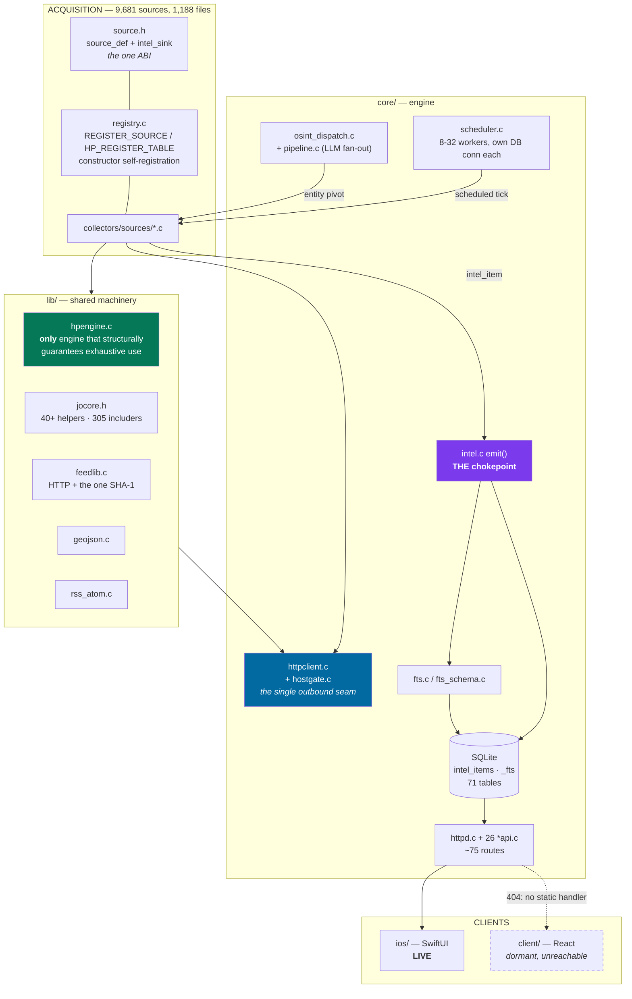
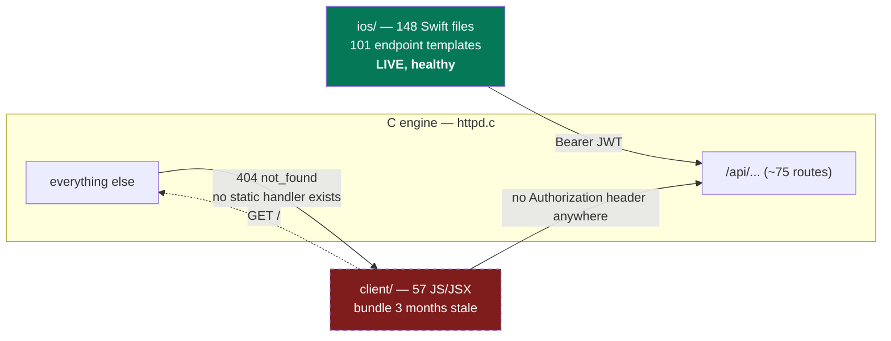

# JapanOSINT — full codebase audit, unification and repair

_2026-08-10 · branch `main` @ `02eb5c3` · 6-agent parallel sweep + orchestrator verification_
_Scope: `native/` (C engine), `ios/`, `client/`, build, tests, CI, docs._
_Unlike the 2026-08-07 audit, this pass **changed code**, in two waves: an audit-and-repair
pass, then a second pass that worked the open list down. Everything claimed as fixed below
was compiled, and the behaviour-changing parts were tested._

> **Read in narrative order.** This report describes the tree as it was *found* and then
> as it was *changed*, so some state flips partway through. In particular `client/`:
> sections 1, 2 and 7 describe it as still present (dormant and unreachable), and §5 is
> where it is removed. Ground truth as of the end of this audit — and today — is that
> `client/` is **gone**, 62 tracked files deleted. Earlier mentions of it are history,
> not current architecture.

---

## 0. The short version

The tree is in materially better shape than the 2026-08-07 audit left it — most of that
report's findings genuinely landed, and this pass verified each rather than inheriting it.
What this audit adds is a set of defects that **no previous pass could have seen**, because
they were hidden by three different kinds of silence:

1. **The build was not warning-clean and nobody could tell**, because an incremental
   `make` only shows what it recompiles. From scratch it emitted **88 warnings**. It is
   now at **0**, and `tests/audit/build_clean.sh` prints the count so it stays visible.
2. **Six collectors were silently dropping a field from every record they emitted.** A
   removed record cap took the loop counter with it, so a "have we written anything?"
   flag stayed 0 forever and the joined value was freed and discarded. Invisible to the
   compiler, to `make audit-sources`, and to every prior audit.
3. **The source counter was blind to 601 registered sources** (16% of a fleet it claimed
   to count exactly), so `make source-count` disagreed with the running binary, and
   `launch.sh` printed a false warning on every single build.

Plus two live authorization holes: a tenant **admin could promote itself to owner**, and
the breach corpus — gated behind platform-operator on four doors — was readable through
a fifth.

**Now green:** clean build **0 warnings** · `hptest` · `authtest` · `pagewalktest` ·
`htmlparsetest` · `selftest` · `unit` — all pass · `source-count` 9,681 ==
`--list-sources` 9,681, **id-for-id, both directions** · `make audit-sources`
**144 → 66** findings across **89 → 50** files, strict set still 0 ·
`lint-sources` `quarantine-empty` **11 → 0** and `snprintf-guard` **6 → 2** (both
were false-positive classes; the checks were made precise, not deleted) and
`geo-precision` **118 → 318** — that one went UP on purpose, because the check
had never been able to see the `gj_point_feature()`/`geojson_emit_*()` path at
all and was blind to 200 collectors.

---

## 1. Ground truth

| Quantity | Value | How |
|---|---|---|
| Registered `source_def`s | **9,681** | `make source-count`, now == the binary |
| — direct `REGISTER_SOURCE` | 1,104 | |
| — macro / row-table expanded | 8,577 | incl. **601** hpengine rows, invisible until today |
| Collector files | 1,188 `.c` + 9 `.inc` | one *family* per file, not one source |
| Collector LOC | 211,060 | |
| `core/` | 74 `.c` + 74 `.h`, 55,382 LOC | |
| `lib/` | 20 `.c` + 23 `.h`, 6,071 LOC | |
| iOS (live client) | 148 Swift, 39,969 LOC | |
| `client/` (React, dormant) | 57 JS/JSX, ~14,700 LOC | unreachable — see §7 |
| Tracked files | 2,615 | |

`MAX_SOURCES` is 32,768 against 9,681 registered — 30% used, comfortable. Note
`registry_add` does an O(n) duplicate scan per call, so registration is O(n²):
~47M `strcmp` at startup. Not a defect today; it is the first thing that will bite at
~50k sources.

---

## 2. System map



**Two polymorphic paths, one switch.** A scheduled run and an on-demand entity pivot use
the *same* `run()` function; the only difference is whether `ctx->entity` is NULL. There
is no separate "service" type. A third path, easy to miss, is `/api/data/:id`, which runs
the same collector into an in-memory **capture** sink and never touches SQLite.

---

## 3. Data flow — one record, end to end

```mermaid
sequenceDiagram
    autonumber
    participant S as scheduler.c
    participant W as worker (own DB conn)
    participant C as collector run()
    participant H as httpclient + hostgate
    participant E as intel.c emit()
    participant D as SQLite
    participant A as httpd + *api.c
    participant I as iOS

    S->>S: 1 Hz tick; skip if quarantined /<br/>search-only / not due
    S->>W: q_push(index) — bounded ring, 2048
    W->>W: db_attach() + busy_timeout 30s
    W->>C: run(ctx{entity=NULL}, count_sink)
    C->>H: feed_get_* / jo_get / hp engine
    H->>H: url_override → hostgate → curl<br/>64MB ceiling · protocol pins · peer recheck
    H-->>C: body
    C->>E: sink->emit(&intel_item)
    E->>D: BEGIN
    E->>D: probe uid (is_new?)
    E->>D: UPSERT intel_items<br/><i>derived-geometry guard: llm/exif geom survives</i>
    E->>D: fts_write — prepare INSERT first,<br/>only then DELETE the old rowid
    E->>D: COMMIT
    Note over E,D: COMMIT rc is now checked; a failed<br/>commit rolls back and returns -1
    E-->>C: 1 = new · 0 = updated · <0 = refused
    W->>S: run_status(rc, records, hosts_ok)<br/><i>transport evidence rescues honest empties</i>
    A->>D: SELECT + keyset cursor
    A-->>I: JSON envelope
```

The ordering at step 10 is load-bearing and was a real bug once: preparing the FTS INSERT
*before* deleting the old row is what stops the search index draining on every re-ingest.

---

## 4. What was fixed in this pass

Every item below was compiled; behaviour-changing ones were tested.

### 4.1 Silent per-record data loss — **the most serious finding**

A previous "remove the record cap" sweep rewrote `if (++n >= CAP) break;` into a comment.
The `n++` went with it — but `n` was also the *"have we written anything yet"* flag, read
twice per loop:

```c
if (n) { strcpy(out + len, ", "); len += 2; }   // separator: never fires
strcpy(out + len, buf); len += strlen(buf);
/* (cap removed: every record of the fetched array is emitted — …) */   // ← n++ was here
}
if (!n) { free(out); return NULL; }             // ← so this ALWAYS fires
```

The joined value was built correctly and then thrown away on every single record.

| Collector | Field silently dropped from every record |
|---|---|
| `academic_world.c` ×2 | Crossref authors; Semantic Scholar authors (also killed `summary` + `author`) |
| `global_openalex.c` | OpenAlex authorships |
| `grants_world.c` | NIH principal investigators |
| `misc_world.c` | DBLP authors (multi-author records) |
| `reg_pl_krs.c` | Polish KRS management board — a field the source's own `.description` advertises |
| `domains_world.c` | Cert Spotter SANs — *and* the missing separator concatenated them: `a.example.jpb.example.jp` |

Fixed at 7 sites. Verified: a detector for "counter read but never incremented" over all
36 files carrying that comment now reports **0**. Two of my own first-pass edits were
wrong (the comment also appears in *emit* loops with no such counter) — the compiler
caught both, and they were reverted.

### 4.2 Authorization

- **Tenant admin → owner self-promotion.** `member_can_manage()` admits `admin`,
  `valid_role()` accepts `"owner"`, and nothing required *being* an owner to *grant*
  owner. An admin could `PATCH /api/members/<self>/role {"role":"owner"}` — the
  last-owner guard does not fire, because it only triggers when the **target** is
  already an owner — then demote the real owner. Full workspace takeover from the lower
  privileged role. Added `may_grant_role()`, applied to both the role-PATCH and the
  invite path.
- **Fabricated audit record on the same route.** The role `UPDATE`'s step result was
  discarded and `member_audit()` ran unconditionally — a hash-chained `member.role` entry
  for a change that may never have landed. Now gated on `sqlite3_changes()`.
- **Breach corpus, fifth door.** `POST /api/cases/:id/items` with
  `ref_type:"breach_item"` called `breach_adapter_item_by_uid()` server-side. The adapter
  redacts the leaked *secret*, but `properties.value` is the breached **identifier**, which
  is precisely what `breach_gate()` (platform-operator) protects on the other four doors.
  Reachable by any tenant analyst, and it *persisted* the identifier into
  `case_items.snapshot_json`. `build_snapshot()` cannot evaluate that gate — it has a
  `tenant_ctx` and no `auth_user` — so the server-side fetch is now refused. The reference
  still attaches; only the content copy is gone. `intelapi.c` had written the rule down
  verbatim: *"If you add a fourth entry point to `breach_adapter_*`, gate it there too."*
  I checked all six entry points; the `alertsapi` one reads only title/source/link and is
  fine.

### 4.3 Build correctness

- **88 → 0 warnings** from a clean build. Breakdown of what they were hiding:

| Class | n | Verdict |
|---|---|---|
| `-Wdeprecated-declarations` | 35 | OpenSSL 3: SHA-1 ×26, RSA/EC ×9 — real API debt |
| `-Wcomment` | 21 | `/api/*`, `image/*`, `*lat/*lon` opening a nested comment |
| `-Wunused-function` | 11 | 9 from a `.c` compiled as a 55th no-op TU; 2 genuinely dead |
| `-Wunused-but-set-variable` | 7 | write-only counters left by removed caps |
| `-Wmissing-field-initializers` | 7 | a 12-field positional table, one comma from silent field-shift |
| `-Wconditional-type-mismatch` | 4 | redundant `x ? x : NULL` |
| **`-Wsometimes-uninitialized`** | **2** | **a real bug** — see below |
| `-Wunused-variable` | 1 | **a real bug** — see below |

- **`biodiversity_world.c`** passed an **uninitialised `lon`** to its emit function: the
  `&&` short-circuits, so a record with a latitude but no longitude left `lon` untouched.
- **`chan_5ch.c`** built a Monazilla `User-Agent` header array and then called
  `feed_get_text()`, which takes no headers. 5ch serves `subject.txt` only to a
  Monazilla-identified client — the collector fetched five boards and emitted nothing,
  every 1800 s. Switched to `jo_get`, which does take headers.

- **Two scripts reported success on a failed build.** `tests/audit/build_asan.sh` and
  `build_clean.sh` both put `make` first in a pipeline (so the shell saw `tail`'s status,
  always 0), used `set -e` without `pipefail`, and then unconditionally echoed "done".
  `build_clean.sh` is the script whose entire job is answering *"does a clean tree
  compile"* — it answered yes unconditionally. Both now read make's own status and prove
  the binary exists. The correct pattern already existed in `agent_build.sh`; it had been
  carried back to `launch.sh` and not to these.

### 4.4 Unification

- **One SHA-1, not five.** `feedlib.c`, `rss_atom.c`, `station_clusterer.c`,
  `jma_volcano.c` and `tenki_jp.c` each hand-rolled the same joined-SHA-1 loop on the
  deprecated OpenSSL 1.1 API. Collapsed into `feed_hash_key` / `feed_hash_join` on EVP.
  These functions mint **database record keys**, so the refactor was proved
  byte-identical against a Python reference — including the trailing-pipe form and
  NULL-part skipping — before being kept.
- **JWT key construction migrated to OpenSSL 3** (`EVP_PKEY_fromdata`). The old path also
  ignored `RSA_new()` and `RSA_set0_key()` failures, leaking a `BIGNUM` and building a
  key with a NULL modulus. The EC branch now left-pads coordinates to the P-256 field
  width — a JWK may ship a coordinate with leading zeros stripped, and an unpadded 31-byte
  X would have shifted Y by a byte and produced a key that verifies nothing.
  **This is authentication code, so it got a real test** (§4.5).
- **`od_shared.c` → `od_shared.inc`.** A `.c` file `#include`d by 54 others *and* compiled
  standalone by the Makefile glob, as a 55th translation unit that emitted no symbols and
  warned about nine of its own helpers. Its header comment claimed this was clean; it was
  not. The `.inc` convention already existed for 8 sibling files.
- **`sanctions_world.c`'s 12-field positional table** → designated initialisers. One
  misplaced comma there silently shifts `xml_alias` into `xml_prog` for a whole sanctions
  source.
- 7 dead counters, 2 dead functions, 4 redundant ternaries removed.

### 4.5 Tooling and CI

- **`lint_sources.py` now reads `HP_REGISTER_TABLE` row tables.** 601 sources across 29
  `hp_*.c` files had never been seen by *any* check — not dup-id, not geo-precision, not
  the counter. One change fixes four things: the count becomes true, `launch.sh` stops
  printing a false "build green but N sources" warning on every build, CI's lint gains
  16% of the registry, and the README's "the only counter that agrees with the binary"
  becomes a fact again. Verified: **0 ids in the binary that lint misses, 0 in lint that
  the binary misses.**
- **`.inc` files are now line-scanned.** They were invisible to every check — 3,057 lines
  of real collector code including one file that ends in an `emit()`. I found this because
  renaming `od_shared.c` made the `geo-precision` count drop by one, which was *coverage
  loss*, not a fix. Restored; the other 8 `.inc` files were genuinely clean.
- **New `make authtest`** — generates real RSA-2048 and P-256 keys, publishes them as
  JWKs, signs real JWTs and runs the real `jwk_to_pkey`/`verify_asym`. Asserts genuine
  signatures verify, tampered ones don't, a signature lifted onto a different payload
  doesn't, and malformed JWKs yield no key. Offline, no key material on disk. The failure
  mode of a wrong public key is not a crash — it is *every legitimate token stops
  verifying* — which no compile and no smoke test can see.
- **CI now gates what already existed and was wired to nothing:** `hptest` (38 assertions
  encoding both house rules), `authtest`, `audit-sources`, and a **second ASan job**.
  Memory safety is this codebase's named critical bug class; `make asan-test` existed and
  ran nowhere.
- Stale `lint_baseline.json` counts corrected (8,079 → 9,681).

---

### 4b. The second pass — working the open list down

**Memory safety.** Two use-after-frees on live paths, both closed:
`progress_get()` returned a raw pointer *after* unlocking while the 200-entry
retention sweep could free it, so readers now go through one
`progress_snapshot(id, &done)` that does the lookup, the serialisation and the
done-read inside a single critical section; the writers keep the pointer, which
is safe because eviction only ever takes a request that is already `done`. And
`httpd_serve`'s `mg_mgr` is a stack local that was freed on SIGTERM while four
kinds of detached thread still held it — every `mg_wakeup` now passes through a
refcounted door that shutdown closes and drains before the frame dies.

**Authorization and outbound safety.** The platform-operator gate matched on an
unverified JWT `email` claim; `auth_email_verified()` existed for exactly that
hazard and had one consumer, on the *lower*-privilege path. `cameraproxy.c` and
`camera_stills.c` each built a raw curl handle with no hostgate call and no
protocol pin, then followed up to five redirects to a URL scraped from a
third-party aggregator — both now carry the same three defences `http_request`
has, including a per-hop peer re-check.

**Silence, as a class.** `intel.c`'s unchecked `COMMIT` is the root of it and is
fixed; a sweep of the same shape across seven more files found the reported
sites and several unreported ones, including a watermark in `translate.c` that
advanced past rows it had never rewritten — terminal data loss from the English
index. Nine `httpd.c` routes that dropped an over-long query string *whole* —
failing open to an unfiltered first page — now share one `qs_copy_or_414()`
helper. The dispatcher no longer counts records the store refused.

**House rule 2, the big one.** `lib/pagewalk.c` is new: it gives the generated
`VJSON`/`VGEO`/`VCSV` collectors a paging path, continuing a walk only where the
upstream said how — a next link in the response, or an offset parameter the
author already wrote — and never inventing a query parameter. Everything it
cannot legitimately reach is emitted as a `collector-truncation-notice`. 30
offline assertions pin both halves (`make pagewalktest`), because continuing
wrongly means fabricated requests against 2,700 real endpoints and stopping
silently is the discard the module exists to end. `jo_truncation_notice()` in
`lib/jocore.h` gives hand-written collectors the same disclosure in one line;
there were four hand-rolled copies of that record before it. Applying it — and
marking the correct-by-design cases with the tree's existing
`/* exhaustive-ok: … */` convention — took `make audit-sources` from 144
findings across 89 files to **66 across 50**, with 145 files now carrying an
explicit justification. The remaining `single-page` count (35) is the honest
residue described under §5 *Accepted*.

**Correctness in the collector tree.** `html_attr()` matched attribute names as
substrings, so `data-src=` satisfied a lookup for `src` and the camera scrapers
stored lazy-load placeholders instead of snapshots — fixed with a boundary
check and 28 assertions (`make htmlparsetest`). `theharvester.c` concatenated an
analyst-supplied entity into four live request URLs with no percent-encoding.
`sans_isc.c` and `hatena_bookmark.c` spliced fetched values into hand-built
`tags_json`, where malformed JSON fails the *whole* tag-filtered listing.

**iOS.** `CameraDiscoveryView.loadMore` fetched a page and then sliced it
straight back off — the retention cap now grows by exactly what a paged request
added, and the remaining bound is stated on screen. `SearchStore`'s SSE task was
never cancelled and captured `self` strongly.

**CI** now gates `pagewalktest`, `htmlparsetest`, `authtest`, `hptest` and
`audit-sources`, plus a second AddressSanitizer job.

### 4c. The half of `core/` the first pass never read

The first pass admitted a coverage gap: roughly half of `core/` got targeted
greps rather than a read. That half was then read properly — 26 files — and it
was not empty. What came out of it, and was fixed:

- **`/api/keys` was a platform-wide credential store gated on a *tenant* role.**
  `keysapi_platform()` checked `is_admin_role(t->role)` — the caller's role in
  their own workspace, which every user has in the workspace they created. So
  any user could read every stored third-party credential in cleartext and
  `PUT` a replacement that took effect for every tenant. Its own header comment
  said "requirePlatformAdmin"; nothing implemented it. Now operator-gated, GET
  and PUT alike.
- **An unauthenticated out-of-bounds read on the break-glass endpoint.**
  `base32_decode` returns −1 on the first non-base32 character, and that −1
  travelled into the HMAC as a key *length*, where OpenSSL's `blocksize <
  keylen` test passes it to a `memcpy` whose length widens to `SIZE_MAX`. The
  trigger is a mistyped `ADMIN_TOTP_SECRET` — `0`, `1`, `8`, `9` and
  punctuation are exactly what a hand-copied secret picks up.
- **An unchecked AES-GCM nonce.** `RAND_bytes` can fail; on failure the nonce
  was uninitialised stack. Nonce reuse in GCM does not merely leak the
  plaintext relationship — it leaks the GHASH subkey and forfeits authenticity
  for the whole key.
- **SMTP header injection through the alert subject.** `encode_subject`
  classified "ASCII" as every byte ≤ 0x7F, so CR and LF took the plain path and
  were copied verbatim into `Subject: %s\r\n`. Rule-name validation only trims
  surrounding whitespace, so an embedded CRLF survived it: any analyst who can
  create an email alert rule could inject arbitrary headers through the
  deployment's own authenticated MTA. Control bytes now force the RFC 2047
  encoded-word, which is base64 and cannot carry a line break.
- **Two silent, permanent data losses.** The FTS rebuild's row scan used
  `while (step() == ROW)`, which cannot tell `DONE` from `IOERR`/`BUSY` — a
  short scan committed a partially repopulated index *and* stamped `_fts_meta`
  with the new version, so `fts_index_is_v2()` answered yes and the migration
  never ran again. And the alert sweep read a short batch as "drained" and
  pushed its watermark to the top of the window, so every mention between the
  failure and that point was never evaluated again. Both now fail closed. The
  rule-snapshot loader had the same shape: a truncated snapshot was published
  *and* stamped current, so enabled alert rules stopped firing indefinitely.

Still open from that read, and listed in §5: `exportapi`'s missing role floor on
non-breach kinds, the OCR path's missing timeout, an inline full-corpus backfill
on first domain-monitor creation, and the several "a short scan is reported as a
complete result" sites that are cosmetic-to-moderate rather than destructive.

## 5. Open findings

A third pass closed the rest of the list, including the four items that had been
parked as decisions. What is genuinely left is below.

### Closed in the third pass

- **The two probe routes now exist.** `POST /api/status/:id/probe` and
  `/consent` were called by the iOS client and had never been implemented — the
  `probe_*` columns and `probe_consent` were read-only scaffolding that nothing
  wrote. The prober does one HEAD/GET of the source's **own registered**
  endpoint (from the registry, never from the caller, through `http_request`'s
  hostgate and protocol pins), sends no collector credential so nothing secret
  can land in columns `statusapi` serves to any reader, and leaves
  `probe_response_headers` NULL because `http_response` does not carry them and
  a reconstruction would be invented content. Operator-gated and audited.
- **The 194 curated cameras are probed.** A HEAD per row per hour; any HTTP
  answer counts as reachable (a 403 still proves the host is there), and the row
  is emitted either way with `reachable` / `last_probe_status` /
  `last_probe_at`, because dropping a camera on one failed probe would discard a
  real catalogue entry over a transient outage. `JO_CAM_PROBE=0` disables it,
  and then the row says `liveness_checked: false` rather than implying a
  freshness it does not have.
- **`client/` is gone** — 62 tracked files removed. It was unreachable three
  independent ways and both READMEs already called it dormant. The ignored
  `node_modules`/`dist` are left on disk deliberately: git-tracked deletions are
  recoverable, untracked ones are not.
- **The eight hand-built JSON bodies in `httpd.c`** that interpolated a
  URL-decoded path segment now escape it.
- The security, silence and collector items from §4c and the earlier list.

### A correction worth recording

`openmeteo_jma.c:65,67` was carried in two successive audits as a **false
positive** on the `snprintf-guard` check — the reasoning being that `off` is
seeded from a nine-entry compile-time city table and so cannot get large. That
is true of the seed and irrelevant to the three appends after it: they are
`%.1f` of doubles taken straight from the upstream JSON, and `%.1f` of 1e308 is
~310 characters. One oversized value pushes `off` past the 224-byte buffer,
after which `summ + off` is out of bounds and `sizeof summ - (size_t)off`
underflows to nearly `SIZE_MAX`, handing the next `snprintf` an unbounded
write — remotely triggerable by the upstream.

It survived because each pass inherited the previous pass's verdict instead of
re-deriving it. It was found only when the tooling work had to justify the
exemption in code rather than in prose. Now clamped; `snprintf-guard` is at 0.

### Still open

**O1 — the iOS Xcode project.** One target, so 564 LOC of widget/share code
never compiles; `CODE_SIGN_ENTITLEMENTS` is unset, so the App Group container is
nil forever. GUI work, runbook at `ios/EXTENSION_TARGETS_TODO.md`. Not fixable
from a shell.

**O2 — `/api/data/cameras/snapshot` is not coming back.** It was a Puppeteer
service. Rather than fake it, the eight affected discovery channels now report
that there is no in-app feed instead of rendering a permanent "couldn't load",
so the failure is honest even though the capability is absent.

**O3 — the remaining `single-page` residue.** The generated collectors that
declare a page size but expose no offset and no next link still fetch once. That
is a *disclosed* bound now, and closing it further would mean inventing a
pagination convention per API. The notice names the remedy.

**O4 — repo weight.** Whatever the hygiene pass did not reclaim of the 23.5 MB
of triplicated llama sonames and the 4.6 MB of committed test output.

## 6. Verdicts on the 2026-08-07 audit

Verified rather than inherited. That report's core findings **largely landed**:

**Fixed and confirmed:** the FTS delete-then-fail index drain · `entitystore` rowid after
an unchecked step · the `pthread_join` index bug · **every** shared-`g_db`-to-detached-thread
violation (all 19 `pthread_create` sites now own a connection) · `utf8_next` over-read ·
`linegeom` NULL deref · mandatory `exp` + `aud` array + `iss` · rate limiting · the two
missing method guards · export query truncation → 414 · `mg_wakeup` unbounded `alloca` ·
response ceiling + protocol pins + per-connection SSRF recheck · `url_override` validation
and removal · `ref_key` credential redaction · `station_clusterer` dangling pointers ·
`breach_index` `fclose(NULL)` · `ffmpeg` pipe `O_CLOEXEC` · `entityapi` tenant predicate ·
`alertsapi` authorization · quarantine-on-success at the scheduler root · CI now exists ·
`launch.sh` build-status check · the fixture-destroying contract suite · `override CFLAGS` ·
`make clean` orphans · an `asan` target · repo junk · the untracked-audit-tree meta-finding.

**Corrected — one of its claims does not hold:** the working tree is clean and the
previously-untracked build-required headers no longer exist at all.

**Two agent claims in *this* pass were wrong and are recorded as such:** `.gitignore` was
reported as missing a `data/` rule — it has one at line 48, and `data/api-keys.json` is
correctly ignored and never committed. And `houjin_bangou.c`/`diet_records.c` were flagged
as missing counters; both assign `= 1` rather than `++`, which my detector's regex missed.

---

## 7. Clients



**iOS is healthy and has visibly absorbed the last audit** — seven of its nine findings
are genuinely closed, not papered over: zero `try!`/`as!`/force-unwrapped URLs remain, the
media views have correct teardown on both platforms, and the WebSocket layer was rewritten
from "assume connected, retry forever" into an honest, compile-time-gated state machine.
Remaining work is concentrated in two files (§5 H6, H7) plus accessibility — 23 sites
bypass the Dynamic Type scale, 11 render below the 11 pt floor, and ~183 of 239 SF Symbols
are unlabeled for VoiceOver.

**`client/` is unreachable three independent ways**: the server has no static handler and
404s every non-`/api` path; `launch.sh` contains zero references to it; and it sends no
`Authorization` header anywhere, so every call would 401 even if served. 17 of its
endpoints no longer exist. Repairing it is not "add a static handler" — it is static
serving *plus* an auth flow it never had *plus* a `/ws` server that was never ported *plus*
a rebuild against a registry that has grown ~4×. Both READMEs already call it dormant.
**Recommendation: delete it and the root `package.json`** — that is executing a decision
already written down twice, and it reclaims 437 MB of `node_modules` on every checkout.

---

## 8. Unification backlog

The honest read: **the collector tree is not primarily duplicated logic.** It is 1,188
files of genuinely per-upstream URL/field/shape knowledge, and the shared machinery
(`jocore.h` 305 includers, `feedlib` 426, `geojson` 213, `overpass` 98) already absorbs
most of what can be absorbed. A full pairwise similarity pass found ~6,500–7,100 LOC
mechanically removable — about **3%**. Worth doing for drift-resistance, not for size.

| # | Opportunity | Files | ~LOC | Risk |
|---|---|---|---|---|
| 1 | `jo_emit_props()` — own only the print→assign→emit→free tail | 576 | 2,100–2,700 | moderate (scale; ownership contract is a UAF footgun) |
| 2 | Make `jo_get` a true superset (2xx, retries), convert raw `http_request` | 131 | 1,300 | moderate — widening changes 284 existing call sites |
| 3 | Finish the `jocore.h` migration (~180 residual local helpers) | ~150 | 900 | mechanical, except `guess_centroid` ×10 (derived geometry) |
| 4 | Convert hand-rolled scrapers to `htmlparse`/`csv`/`rss_atom` | 62 | 900 | moderate — hand-rolled quirks are often load-bearing |
| 5 | Inline GeoJSON Features → `gj_point_feature` | 65 | 550 | moderate — **key order is load-bearing**; the uid hash fingerprints printed geometry, so careless conversion re-uids every feature |
| 6 | Collapse ~47 per-file `*_DEF` registration macros | 47 | 500 | moderate — 59 independent copies of the `source_def` field list is the sharpest drift risk in the tree |

**The pattern worth naming again:** every fix in this pass already existed somewhere in
the tree. `scheduler.c` checks the emit return, `osint_dispatch.c` does not.
`agent_build.sh` checks the build status, two sibling scripts do not. `/api/export`
returns 414, nine siblings silently widen. `intelapi.c` wrote down the breach-gate rule
that `casesapi.c` then broke. The dominant failure mode is **silence**, and silence is
what a linter catches — which is why the highest-leverage work in §5 is not any single
bug but `make lint-sources` learning to see two more shapes.

---

## Appendix — method

Six subagents ran read-only in parallel (core engine, collector fleet, iOS, build/tests/
docs/client, security, architecture/duplication). Two stalled and were relaunched.
The orchestrator independently re-verified, by reading the code, every finding that was
acted on: the missing counters, both authorization holes, the `.gitignore` claim (wrong),
the `od_shared` compile behaviour, and the breach adapter's actual payload.

Claims are marked by how they were established. Where a subagent's claim failed
re-checking it is recorded as such (§6). Measurements come from commands run in-session
and are reproducible: `make source-count`, `make lint-sources`, `make audit-sources`, a
from-scratch `-fsyntax-only` sweep over all 1,282 first-party translation units, and a
`comm` diff of lint ids against `--list-sources`.

**Not covered:** roughly half of `core/` received targeted checks rather than a full read
(named in the core agent's coverage list — `media.c`, `camera_stills.c`, `uploadapi.c`,
`exportapi.c`, `alert_eval.c`, `reportapi.c` and ~27 others). No `.db` was opened, so the
prior audit's timing figures were not re-measured. No collector was run against a live
upstream, so §5 C1's per-source record counts are read from API documentation and response
envelopes, not observed.
